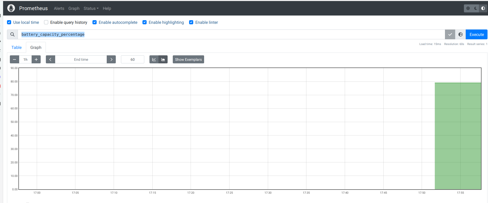

# Battery2Prometheus

This repo is a form of [https://github.com/jiajunhuang/battery_exporter](https://github.com/jiajunhuang/battery_exporter)

I have done a fork as I need battery capacity (%) which was not available. 

Many thnaks to the original developer *jiajunhuang*

Battery Exporter for Prometheus, you can use this exporter to monitor your battery infomation include:

- energy by design
- energy now
- energy full
- battery charge cycle count
- battery capacity 


## Usage

- download this repo
- enter the battery2prometheus and build the program 

```bash
$ go build
```
- change the prometheus target according to your IP

```bash
static_configs:
      - targets: ["172.17.0.1:9119"]
``` 

- make the deamon running automatically (see your init system). In my case I just added it to rc.local
- run prometheus using docker in the following way 

```bash
$ docker run --name prometheus -d --restart unless-stopped  -p 9090:9090 -v ./:/etc/prometheus prom/prometheus
```
- access prometheus console on http://127.0.0.1:9090/graph
- Execute this query *battery_capacity_percentage*


